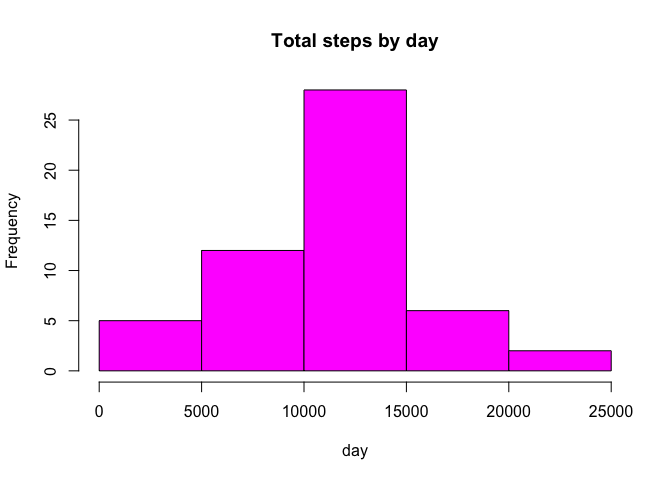
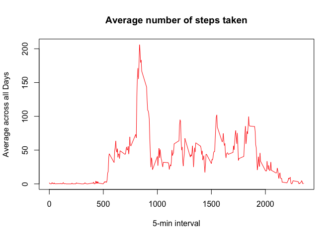
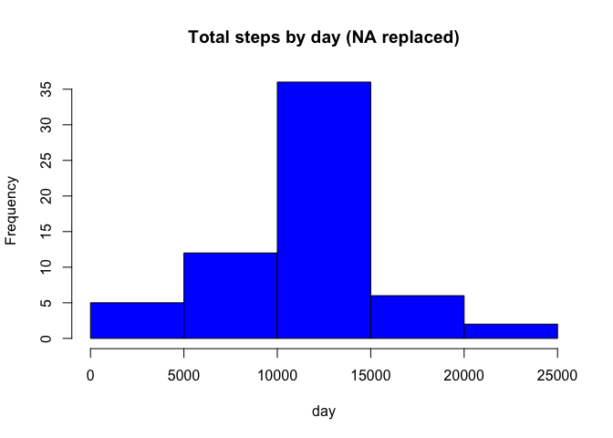

# Reproducible Research: Peer Assessment 1


## Loading and preprocessing the data


```r
activity <- read.csv("activity.csv", colClasses = c("numeric", "character", "numeric"))
head(activity)
```

```
##   steps       date interval
## 1    NA 2012-10-01        0
## 2    NA 2012-10-01        5
## 3    NA 2012-10-01       10
## 4    NA 2012-10-01       15
## 5    NA 2012-10-01       20
## 6    NA 2012-10-01       25
```

```r
names(activity)
```

```
## [1] "steps"    "date"     "interval"
```

```r
library(lattice)
activity$date <- as.Date(activity$date, "%Y-%m-%d")
```


## What is mean total number of steps taken per day?

Let's aggregate the data by date and draw the histogram.

```r
StepsNumber <- aggregate(steps ~ date, data = activity, sum, na.rm = TRUE)
hist(StepsNumber$steps, main = "Total steps by day", xlab = "day", col = "magenta")
```

 

Then compute the mean and median values

```r
mean(StepsNumber$steps)
```

```
## [1] 10766.19
```

```r
median(StepsNumber$steps)
```

```
## [1] 10765
```


## What is the average daily activity pattern?


```r
time_series <- tapply(activity$steps, activity$interval, mean, na.rm = TRUE)
plot(row.names(time_series), time_series, type = "l", xlab = "5-min interval", 
    ylab = "Average across all Days", main = "Average number of steps taken", 
    col = "red")
```

 

The interval having the higher number of steps on average across all the days in the dataset is

```r
max_interval <- which.max(time_series)
names(max_interval)
```

```
## [1] "835"
```


## Imputing missing values

The number of missing values int the dataset is 

```r
activity_NA <- sum(is.na(activity))
activity_NA
```

```
## [1] 2304
```
The chosen strategy is to replace these NA values by the 5 minutrs interval mean of the day:

```r
intervalAvg <- aggregate(steps ~ interval, data = activity, FUN = mean)
fillNA <- numeric()
for (i in 1:nrow(activity)) {
    obs <- activity[i, ]
    if (is.na(obs$steps)) {
        steps <- subset(intervalAvg, interval == obs$interval)$steps
    } else {
        steps <- obs$steps
    }
    fillNA <- c(fillNA, steps)
}
```
Create a new set of data:

```r
new_activity <- activity
new_activity$steps <- fillNA
```
Recalculate the total number of steps in a day based on the new dataset and draw the histogram:

```r
StepsNumber2 <- aggregate(steps ~ date, data = new_activity, sum, na.rm = TRUE)
hist(StepsNumber2$steps, main = "Total steps by day (NA replaced)", xlab = "day", col = "blue")
```

 

And finally compute mean and median values

```r
mean(StepsNumber2$steps)
```

```
## [1] 10766.19
```

```r
median(StepsNumber2$steps)
```

```
## [1] 10766.19
```

It seems that the chosen replacement startegy is slightly modifying the median value of the day leaving unchanged the mean.


## Are there differences in activity patterns between weekdays and weekends?

Create a new factor variable in the dataset with two levels – “weekday” and “weekend” indicating whether a given date is a weekday or weekend day.


```r
day <- weekdays(activity$date)
daylevel <- vector()
for (i in 1:nrow(activity)) {
    if (day[i] == "Samedi") {
        daylevel[i] <- "Weekend"
    } else if (day[i] == "Dimanche") {
        daylevel[i] <- "Weekend"
    } else {
        daylevel[i] <- "Weekday"
    }
}
activity$daylevel <- daylevel
activity$daylevel <- factor(activity$daylevel)

stepsByDay <- aggregate(steps ~ interval + daylevel, data = activity, mean)
names(stepsByDay) <- c("interval", "daylevel", "steps")
```


```r
xyplot(steps ~ interval | daylevel, stepsByDay, type = "l", layout = c(1, 2), 
    xlab = "Interval", ylab = "Number of steps")
```

 
